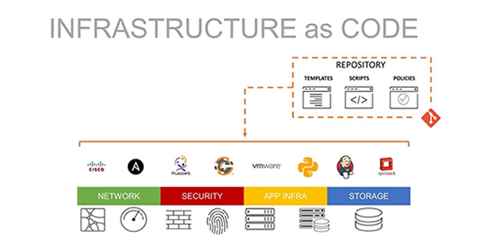
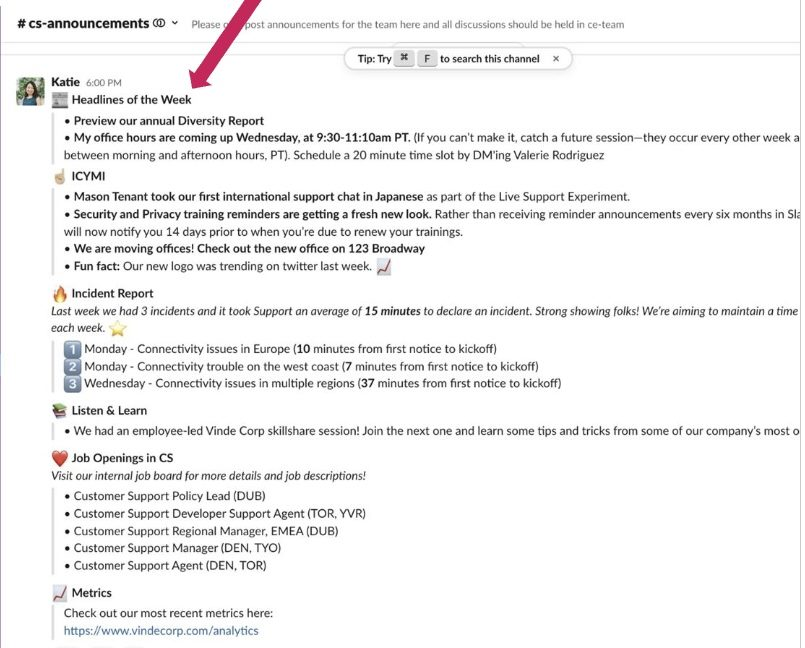

**Unidade:** Senai Nova Lima  
**Instrutor:** Frederico Martins Aguiar  
**Integrantes:** Marilene Araujo e Miguel Duarte

---

# Metodologia DevOps

---

# 1. Definição

O DevOps é uma abordagem que combina **práticas, ferramentas e uma cultura organizacional colaborativa** com o objetivo de integrar as equipes de desenvolvimento de software e operações de TI. Essa integração permite que as empresas **desenvolvam, testem e distribuam aplicações e serviços de forma mais rápida, eficiente e confiável**.

DevOps é uma junção das palavras inglesas **Development (desenvolvimento)** e **Operations (operações)**. Trata-se de uma abordagem cultural e técnica que une as equipes de desenvolvimento de software e de infraestrutura/operações de TI, que tradicionalmente trabalhavam separadamente.

Ao adotar o DevOps, as organizações conseguem melhorar a comunicação entre equipes e acelerar o ciclo de desenvolvimento, possibilitando atualizações e melhorias contínuas nos produtos.

Diferente dos modelos tradicionais de desenvolvimento e gerenciamento de infraestrutura, o DevOps favorece um **fluxo de trabalho mais ágil e integrado**, o que contribui para:

* Entregas mais frequentes.
* Maior qualidade do software.
* Menor tempo de resposta às demandas do mercado.

---

## A. Objetivos do DevOps

O DevOps tem como principal objetivo **reduzir o tempo do ciclo de desenvolvimento de sistemas**, permitindo que softwares de alta qualidade sejam entregues com **maior velocidade, confiabilidade e frequência**.

Para isso, essa metodologia busca **eliminar as barreiras entre as equipes de desenvolvimento (Dev) e operações de TI (Ops)**, promovendo integração em todas as etapas do processo, desde a criação do software até sua implementação em produção.

### Principais Metas e Benefícios

* **Velocidade de entrega**: Possibilita a liberação mais rápida de novas funcionalidades, melhorias e correções.
* **Confiabilidade e qualidade**: Por meio de práticas como monitoramento constante e integração, contribui para aumentar a estabilidade dos sistemas.
* **Colaboração**: Promove a integração entre equipes que antes trabalhavam de forma separada, incentivando o respeito e a cooperação profissional.
* **Resposta rápida ao mercado**: Com ciclos de desenvolvimento mais curtos, as empresas conseguem adaptar seus produtos rapidamente.

---

## B. Por que o DevOps surgiu?

O DevOps surgiu porque o **modelo tradicional de desenvolvimento de software estava gerando muitos problemas dentro das empresas de tecnologia**. Profissionais das áreas de desenvolvimento e operações perceberam que o isolamento das equipes causava atrasos, erros frequentes e dificuldades na entrega de software.

No modelo antigo:
* Os desenvolvedores eram responsáveis apenas por criar o código.
* Outra equipe cuidava de implantar, manter e operar o sistema.

Como essas equipes tinham objetivos diferentes, a comunicação limitada gerava falhas nas versões lançadas e insatisfação dos usuários. O movimento DevOps surgiu para aproximar essas áreas, incentivando a colaboração e o uso de ferramentas digitais para documentar e compartilhar o trabalho.

---

# 2. Características e Princípios do DevOps

O **DevOps** não é apenas uma ferramenta, mas uma mudança cultural que une o Desenvolvimento (Dev) e as Operações (Ops). Sua essência está em entregar valor ao cliente de forma rápida, segura e com alta qualidade.

---

## A. Princípios Fundamentais

Para realizar todo o potencial do DevOps, as equipes seguem estes pilares essenciais:

* **Colaboração (Culture):** Quebra os "silos" organizacionais. Desenvolvedores e Operações trabalham como uma única equipe funcional, compartilhando responsabilidades do início ao fim do produto.
* **Automação:** É o coração do ciclo. Automatizar o ciclo de vida do software reduz erros humanos, aumenta a produtividade e permite respostas rápidas ao feedback.
* **Melhoria Contínua:** Focada na experimentação e otimização constante de velocidade e custo, garantindo que o software evolua sempre.
* **Foco no Cliente:** Utiliza ciclos curtos de feedback para criar produtos que resolvam problemas reais, baseando-se em dados de uso real e não apenas suposições.
* **Criar com o Final em Mente:** As equipes têm uma compreensão holística do produto, da ideia inicial até a sustentação em produção.

---

## B. O Ciclo de Vida DevOps (DevOps Lifecycle)

Conforme visualizado na imagem do infinito ($\infty$), o ciclo divide-se entre as fases de construção e as fases de operação:

  

### Lado DEV (Development)
1.  **Plan (Planejar):** Definição de requisitos, metas e alinhamento com as necessidades do usuário.
2.  **Create (Criar):** Fase de desenvolvimento, onde o código é escrito e as novas funções ganham forma.
3.  **Verify (Verificar):** Execução de testes automáticos para garantir a qualidade e segurança do código.
4.  **Package (Empacotar):** Transformação do código aprovado em um "pacote" pronto para ser implantado (artefato).

### Lado OPS (Operations)
5.  **Release (Liberar):** Gerenciamento da entrega da nova versão para o ambiente de destino.
6.  **Configure (Configurar):** Preparação da infraestrutura, servidores e parâmetros para que o software rode perfeitamente.
7.  **Monitor (Monitorar):** Acompanhamento em tempo real da performance e da experiência do usuário.

---

> **IMPORTANTE:**
>  
> **Por que o Ciclo representa o Infinito?**
> 
> O objetivo desta estrutura é criar um fluxo onde o **Monitoramento** (etapa 7) gera dados que retroalimentam o novo **Planejamento** (etapa 1). Isso garante um software sempre disponível, estável e em constante evolução.
---

# 3. Tipos de Projetos Mais Adequados

O DevOps é especialmente indicado para projetos que precisam de **entregas frequentes, atualizações constantes e alta escalabilidade**. Esse tipo de metodologia funciona melhor em ambientes onde o software precisa evoluir rapidamente e manter um funcionamento estável mesmo com muitas mudanças.

De modo geral, o DevOps é mais utilizado em projetos que envolvem **desenvolvimento contínuo, infraestrutura em nuvem e serviços que precisam estar sempre disponíveis para os usuários**.

A seguir estão alguns dos tipos de projetos mais adequados para a aplicação do DevOps.

## 1. Aplicações Web e Mobile 📱

Projetos de **aplicações web e aplicativos mobile** se beneficiam muito do DevOps, pois normalmente precisam receber **atualizações frequentes, correções de erros e novas funcionalidades**.

Com o uso de práticas como **integração contínua (CI) e entrega contínua (CD)**, as equipes conseguem lançar novas versões do sistema rapidamente, garantindo que os usuários tenham acesso às melhorias sem precisar esperar longos ciclos de desenvolvimento.

Além disso, o DevOps permite que essas aplicações suportem **milhares ou até milhões de usuários simultaneamente**, mantendo a estabilidade e a performance do sistema.

## 2. Sistemas em Nuvem (Cloud Native) ☁️

O DevOps é amplamente utilizado em sistemas baseados em **computação em nuvem (Cloud Computing)**, também conhecidos como **Cloud Native**.

Esses sistemas são desenvolvidos para funcionar em infraestruturas escaláveis oferecidas por plataformas como:

- Amazon Web Services (AWS)
- Microsoft Azure
- Google Cloud Platform (GCP)

Nesse tipo de ambiente, o DevOps facilita a **automação da infraestrutura**, permitindo que recursos como servidores, bancos de dados e redes sejam configurados automaticamente. Isso possibilita que as empresas aumentem ou diminuam a capacidade do sistema conforme a demanda dos usuários.

## 3. Plataformas de Streaming 🎥

Plataformas de streaming, como serviços de vídeo ou música online, também utilizam DevOps com frequência. Esses sistemas precisam lidar com **grandes volumes de dados e milhões de acessos ao mesmo tempo**.

O DevOps permite que essas plataformas realizem **atualizações e melhorias no sistema sem interromper o serviço**, garantindo uma experiência contínua para os usuários.

Além disso, práticas como monitoramento constante e automação ajudam a detectar e corrigir problemas rapidamente, evitando falhas que poderiam afetar muitos usuários ao mesmo tempo.

## 4. Sistemas SaaS (Software as a Service) 🛜

Os sistemas **SaaS (Software as a Service)** são aplicações que funcionam diretamente pela internet e geralmente são acessadas por meio de navegadores ou aplicativos.

Esses sistemas precisam receber **atualizações constantes, melhorias de segurança e novas funcionalidades**, muitas vezes sem que o usuário perceba mudanças no funcionamento da aplicação.

Com o DevOps, as equipes conseguem implementar essas atualizações de forma **automática e contínua**, garantindo que o software esteja sempre atualizado e funcionando corretamente.

Além disso, o DevOps facilita a implementação de **testes automatizados e monitoramento em tempo real**, o que ajuda a manter a qualidade e a estabilidade do sistema mesmo com mudanças frequentes.

---

Em resumo, o DevOps é mais adequado para projetos que precisam de **entrega rápida de software, alta disponibilidade, escalabilidade e melhorias contínuas**, características comuns em sistemas modernos baseados na internet e em serviços digitais.

---

# 4. Ferramentas Associadas
Arquitetura de desenvolvimento das melhores práticas para a execução de desenvolvimento e operações (DevOps)

  

O ecossistema DevOps é composto por uma "corrente" de ferramentas que automatizam o ciclo de vida do software. Com base na representação gráfica da atividade, detalhamos as principais categorias:

### 4.1. Controle de Versão e Repositórios
Essas ferramentas permitem que múltiplos desenvolvedores trabalhem no mesmo código sem conflitos, mantendo um histórico de todas as alterações.
* **Git**: O sistema de controle de versão distribuído mais utilizado no mundo.

 

  

* **GitHub / GitLab**: Plataformas que hospedam os repositórios Git, oferecendo recursos de revisão de código (Pull Requests) e gerenciamento de projetos.

| Repositório Local (Git) | Repositório Remoto (GitLab) |
| :---: | :---: |
|  |  |
| *Controle de versão na máquina do desenvolvedor.* | *Plataforma de colaboração e automação na nuvem.* |

### 4.2. Integração e Entrega Contínua (CI/CD)
É o coração da automação DevOps. Elas garantem que cada alteração no código seja testada e preparada para publicação automaticamente.
* **Jenkins**: Uma das ferramentas de automação open-source mais robustas para criar pipelines complexos.
  
 

| Jenkins CI Process | Integração Contínua |
| :---: | :---: |
|  |  |
| *Fluxo de automação utilizando Jenkins.* | *Ciclo lógico da integração contínua (CI).* |

* **GitLab CI / CircleCI**: Ferramentas modernas focadas em rapidez, que executam testes automatizados assim que o desenvolvedor envia o código para o repositório.

  

| GitLab CI (Integração Contínua) | GitLab CD (Entrega Contínua) |
| :---: | :---: |
|  |  |
| *Fase de automação de build e testes.* | *Fase de automação de deploy em produção.* |

### 4.3. Virtualização, Containers e Orquestração
Resolvem o problema do "na minha máquina funciona", garantindo que o software rode da mesma forma em qualquer computador ou servidor.
* **Docker**: Cria "containers" que empacotam a aplicação com todas as suas dependências (bibliotecas, banco de dados, etc.).
  

  
* **Kubernetes (K8s)**: Atua como o "maestro" dos containers, gerenciando automaticamente a escala e a disponibilidade deles em grandes servidores.

### 4.4. Monitoramento e Observabilidade
Permitem que a equipe de Operações (Ops) acompanhe o desempenho do sistema em tempo real e identifique falhas antes mesmo que o usuário perceba.

| Monitoramento e Observabilidade | Ferramenta: Prometheus |
| :---: | :---: |
|  |  |

* **Zabbix / Nagios**: Focados no monitoramento de infraestrutura e rede.
* **Prometheus & Grafana**: O Prometheus coleta dados métricos, enquanto o Grafana gera painéis visuais (dashboards) detalhados sobre o estado da aplicação.
* **New Relic**: Oferece visibilidade profunda sobre o tempo de resposta das transações no software.

---

## 4.5. Infraestrutura como Código (IaC) e Gerenciamento de Configuração

A Infraestrutura como Código (IaC) consiste na gestão e no provisionamento da infraestrutura de tecnologia através de arquivos de definição legíveis por máquina. Esta prática substitui processos manuais e configurações físicas, mitigando a incidência de erros humanos e garantindo a repetibilidade do ambiente.

  
   
  <em><b> Arquitetura IaC:</b> Arquitetura de camadas de infraestrutura automatizada via código.</em>

### 4.5.1. Conceitos e Ferramentas

A utilização de scripts para configurar servidores inteiros elimina falhas operacionais e permite o escalonamento ágil de recursos. As principais ferramentas utilizadas no mercado incluem:

* **Ansible:** Utiliza uma linguagem simples e declarativa (YAML) para automatizar o fornecimento de infraestrutura e o *deploy* de aplicações, destacando-se pela facilidade de implementação.
* **Puppet & Chef:** Focadas no gerenciamento de configuração, estas plataformas automatizam a instalação e parametrização de softwares em milhares de servidores simultaneamente, assegurando que todos os nós mantenham a conformidade técnica estabelecida.
  
---

## 4.6. Comunicação e Colaboração (Real-time Communication)

Essenciais para a integração entre as frentes de Desenvolvimento (Dev) e Operações (Ops), estas ferramentas atuam como o terminal de controle unificado do ciclo de vida de software. Elas centralizam alertas, discussões estratégicas e a tomada de decisão em um ecossistema acessível via desktop e dispositivos móveis.

| Logo da Ferramenta | Interface de Comunicação e Alertas |
| :---: | :--- |
|  |  |
| **Figura X:** Identidade visual representativa. | **Figura Y:** Exemplo de fluxo de incidentes e métricas. |

### 4.6.1. Ferramentas de ChatOps e Monitoramento
Plataformas como **Slack** e **Microsoft Teams** viabilizam o conceito de *ChatOps*, onde robôs de automação integram-se ao fluxo de trabalho para enviar notificações em tempo real sobre o status de testes, sucessos de *deploy* ou falhas críticas de infraestrutura. 

Essa centralização é fundamental para o acompanhamento de métricas de desempenho operacional, como o **MTTR** (*Mean Time to Repair*). Um fluxo típico de resposta a incidentes nestas plataformas pode ser observado abaixo:

> **Exemplo de Relatório de Incidentes (Extraído de Logs de Monitoramento):**
> * **Incidente 01:** Falha de conectividade na Região Europa.
>     * *Tempo de Resposta:* 10 minutos do alerta inicial até a triagem.
> * **Incidente 02:** Instabilidade de latência no banco de dados SQL.
>     * *Tempo de Resposta:* 7 minutos.

### 4.6.2. O Papel da Inteligência Artificial (IA) no Contexto DevOps
A Inteligência Artificial potencializa a colaboração ao transformar grandes volumes de dados brutos em informações acionáveis, mitigando a "fadiga de alertas" através de:

1. **Filtragem de Ruído:** Agrupamento de notificações redundantes em um único incidente contextualizado.
2. **Resumo de Crise:** Geração de sínteses automáticas sobre discussões em canais de incidentes (*War Rooms*), acelerando o alinhamento de novos membros da equipe.
3. **Recuperação de Conhecimento:** Uso de busca semântica para consultar históricos de soluções técnicas passadas via linguagem natural.

### 4.6.3. Benefícios Práticos da Integração
* **Redução do Ciclo de Feedback:** Notificação imediata ao desenvolvedor em caso de falha em *builds* ou testes automatizados.
* **Documentação Viva:** Manutenção de uma trilha de auditoria e base de conhecimento dinâmica através do histórico de decisões e notas integradas (como *Canvas* ou *Wikis*).
* **Mobilidade Operacional:** Garantia de resposta a eventos críticos através de notificações *push* em dispositivos móveis, independente da localização do engenheiro.

---

# 5. Vantagens e Desvantagens

A adoção do DevOps traz benefícios estratégicos, mas também impõe desafios técnicos:

### Vantagens
* **Entrega de software mais rápida**: Redução do "Time-to-Market".
* **Menos erros e maior estabilidade**: Automação de testes e processos reduz falhas humanas.
* **Melhor colaboração**: Integração real entre as equipes de desenvolvimento e operações.
* **Atualizações constantes**: Capacidade de melhorar o produto sem interromper o uso.

### Desvantagens
* **Implementação complexa**: Exige um planejamento rigoroso para integrar todas as ferramentas.
* **Mudança Cultural**: É necessário quebrar a resistência de equipes que trabalham de forma isolada.
* **Conhecimento Técnico Elevado**: Exige profissionais qualificados em automação e infraestrutura moderna.

---

# 6. Exemplos de Aplicabilidade e Casos Reais

O DevOps é o motor por trás das maiores plataformas digitais do mundo. Abaixo, detalhamos como grandes empresas e projetos específicos utilizam essa metodologia para manter a liderança:

### 6.1. Netflix: O Caos como Ferramenta de Teste
A Netflix é pioneira em DevOps e criou o conceito de **Chaos Engineering**. 
* **Como aplicam**: Eles utilizam uma ferramenta chamada *Chaos Monkey*, que desliga servidores propositalmente em ambiente de produção para testar se o sistema consegue se recuperar sozinho. 
* **Resultado**: Isso garante que, se um servidor real falhar, o usuário nem perceba, mantendo a alta disponibilidade para milhões de pessoas.

### 6.2. Amazon: Deploys a cada 11 segundos
A Amazon revolucionou a entrega de software ao migrar de um sistema gigante (monolítico) para milhares de pequenos serviços independentes.
* **Como aplicam**: Através de uma automação pesada e cultura de "quem constrói, opera", os desenvolvedores são responsáveis pelo ciclo completo. 
* **Resultado**: A empresa consegue realizar implantações de código milhares de vezes por dia, permitindo que novas funcionalidades cheguem ao site quase instantaneamente.

### 6.3. Google e Facebook: Escala Global e Atualizações Invisíveis
Estas empresas gerenciam infraestruturas que nunca podem parar, utilizando práticas de **SRE (Site Reliability Engineering)**, que é a aplicação do DevOps focada em confiabilidade.
* **Como aplicam**: Utilizam ferramentas de orquestração (como o Kubernetes, que nasceu no Google) para gerenciar bilhões de containers. 
* **Resultado**: As atualizações de interface ou algoritmos são feitas de forma progressiva e invisível para o usuário final.

### 6.4. Projetos de Monitoramento e Automação (Caso Prático)
O DevOps não serve apenas para gigantes da tecnologia, mas também para projetos técnicos de alta precisão:
* **Exemplo**: Sistemas de medição automática de volume ou monitoramento hídrico.
* **Aplicação**: Nestes casos, o DevOps garante que o fluxo de dados dos sensores seja contínuo. Se um sensor parar de enviar informações, o sistema de monitoramento automatizado detecta a falha, gera um alerta imediato e permite uma correção rápida sem perda de dados históricos.

---

# 7. Comparação com Outras Metodologias

Uma visão comparativa ajuda a entender por que o DevOps é a escolha de muitas software houses atuais:

| Metodologia | Foco Principal | Diferencial |
| :--- | :--- | :--- |
| **Waterfall (Cascata)** | Processo linear e rígido. | O DevOps permite ciclos rápidos e correções durante todo o caminho. |
| **Scrum / Agile** | Gestão e desenvolvimento ágil. | O DevOps leva a agilidade para além do código, chegando até a operação. |
| **Spiral Model** | Gestão de riscos por fases. | O DevOps foca na fluidez e entrega contínua em vez de fases isoladas. |
| **DevOps** | Integração Dev + Ops. | Automação total do ciclo de vida, do planejamento ao monitoramento. |

---

# 8. Curiosidades e Tendências para o Futuro

Este tópico apresenta fatos pouco conhecidos sobre o movimento DevOps e as inovações que estão moldando a próxima década do desenvolvimento de software.

### 8.1. Curiosidades que Definiram o DevOps
* **O "Aniversário" do DevOps**: O termo foi cunhado por Patrick Debois em 2009. Ele queria participar de uma conferência de desenvolvimento ágil, mas como não encontrou nada focado em operações, criou seu próprio evento: o *DevOpsDays* na Bélgica.
* **O Símbolo do Infinito**: Diferente de outras metodologias que possuem começo, meio e fim, o DevOps utiliza o infinito para reforçar que o software nunca está "pronto", mas em um estado de evolução perpétua.
* **A Cultura do "Blame-Free" (Sem Culpa)**: Em empresas que utilizam DevOps de elite, quando um sistema cai, ninguém é demitido. Em vez disso, realiza-se um "Post-mortem sem culpa" para entender qual falha no **processo** permitiu o erro humano, focando no aprendizado e não na punição.

### 8.2. Tendências e o Futuro do Setor
O DevOps está evoluindo para novas vertentes que utilizam tecnologias de ponta:

* **AIOps (Inteligência Artificial para Operações)**: É a tendência de usar IA e Machine Learning para analisar os bilhões de dados gerados por sistemas complexos. A IA poderá prever uma queda de servidor antes mesmo de ela acontecer e realizar o "auto-reparo" (self-healing) sem intervenção humana.
* **GitOps**: Uma evolução onde o Git se torna a única fonte de verdade para a infraestrutura. Toda e qualquer mudança no servidor é feita através de um "Pull Request", trazendo para a infraestrutura o mesmo rigor e controle que temos no código.
* **NoOps (Operações Zero)**: O objetivo supremo do futuro, onde o ambiente de computação é tão automatizado e abstraído (através de Serverless e Nuvem) que não há mais necessidade de uma equipe de operações dedicada para gerenciar recursos.
* **Plataformas de Engenharia (Internal Developer Platforms)**: Em vez de cada desenvolvedor configurar suas ferramentas, as empresas estão criando plataformas internas "self-service", onde o desenvolvedor clica em um botão e ganha todo o ambiente pronto e seguro para trabalhar.

### 8.3. O Impacto da Sustentabilidade (GreenOps)
Uma tendência crescente é o **GreenOps**, onde o foco do DevOps também passa a ser a eficiência energética. As ferramentas de monitoramento agora medem não apenas a velocidade, mas também o consumo de carbono dos servidores na nuvem, otimizando o código para ser mais sustentável.

---

# 9. Conclusão

Ao analisarmos a metodologia DevOps, fica evidente que não estamos lidando apenas com um conjunto de ferramentas tecnológicas, mas sim com uma profunda **mudança de cultura e mentalidade** no desenvolvimento de software. 

No modelo tradicional, existia uma barreira entre quem criava o código e quem mantinha o sistema no ar, o que frequentemente gerava atrasos, falhas de comunicação e retrabalho. O DevOps chega para derrubar esse muro, estabelecendo que o sucesso do produto é uma **responsabilidade compartilhada** desde o planejamento até o monitoramento em produção.

Através dos pilares que exploramos como a automação de processos, o feedback contínuo e a integração de segurança (DevSecOps) as organizações conseguem atingir um nível de agilidade que antes era impossível. É essa abordagem que permite que grandes plataformas entreguem atualizações constantes com alta confiabilidade e segurança.

Para nós, profissionais de tecnologia, compreender o DevOps é entender o ritmo do mercado atual. O domínio dessas práticas é o que diferencia um desenvolvimento isolado de uma entrega de software de alta performance, focada em gerar valor real para o usuário final de forma rápida, segura e sustentável.

---
# Bibliografia

AMAZON WEB SERVICES. *What is DevOps?* Disponível em: <https://aws.amazon.com/devops/what-is-devops/>. Acesso em: 14 mar. 2026.

ATLASSIAN. *DevOps.* Disponível em: <https://www.atlassian.com/devops>. Acesso em: 14 mar. 2026.

GITLAB. *DevOps.* Disponível em: <https://about.gitlab.com/topics/devops/>. Acesso em: 14 mar. 2026.

GITLAB. *Introduction to CI/CD.* Disponível em: <https://docs.gitlab.co.jp/ee/ci/introduction>. Acesso em: 14 mar. 2026.

RED HAT. *O que é DevOps?* Disponível em: <https://www.redhat.com/pt-br/topics/devops>. Acesso em: 14 mar. 2026.

THINKR. *Transform a folder as Git project synchronized on GitHub or GitLab.* Disponível em: <https://rtask.thinkr.fr/transform-a-folder-as-git-project-synchronized-on-github-or-gitlab/>. Acesso em: 14 mar. 2026.

MICROSOFT. Orquestrar microsserviços e aplicativos de vários contêineres para alta escalabilidade e disponibilidade. Disponível em: https://learn.microsoft.com/pt-br/dotnet/architecture/microservices/architect-microservice-container-applications/scalable-available-multi-container-microservice-applications. Acesso em: 14 mar. 2026.

SLACK. *Slack for internal communications: 7 ways to improve company-wide communication.* Disponível em: <https://slack.com/blog/collaboration/slack-for-internal-communications>. Acesso em: 16 mar. 2026.

